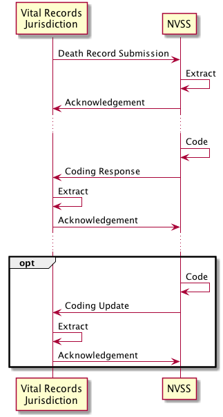
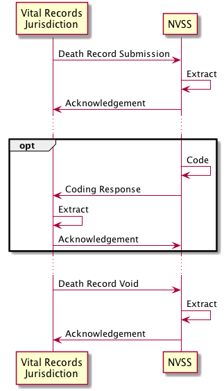
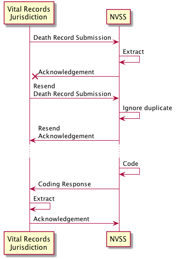

# Using the VRDR.Messaging Library

This document describes how to use the VRDR.Messaging library to simplify implementation of VRDR message exchange flows.

## Death Record Submission

The diagram below illustrates the messages exchanged during submission of a death record and the subsequent return of coded causes of death and race and ethnicity information.



### Submit Death Record

A vital records jurisdiction can create a death record submission as follows:

```cs
// Create a DeathRecord
DeathRecord record = ...;

// Create a submission message
DeathRecordSubmission message = new DeathRecordSubmission(record);
message.MessageSource = "https://example.com/jurisdiction/message/endpoint";

// Create a JSON representation of the message (XML is also supported via the ToXML method)
string jsonMessage = message.ToJSON();

// Send the JSON message
...
```

The `DeathRecordSubmission` constructor will extract information from the supplied `DeathRecord` to populate the corresponding message property values (`StateAuxiliaryIdentifier`, `CertificateNumber`, `NCHSIdentifier`) automatically.

### Extract Death Record

On receipt of a message, NCHS can parse it, determine the type of the message, and extract a death record using the following steps:

```cs
// Get the message as a stream
StreamReader messageStream = ...;

// Parse the message
BaseMessage message = BaseMessage.Parse(messageStream);

// Switch to determine the type of message
switch(message)
{
    case DeathRecordSubmission submission:
        var record = submission.DeathRecord;
        var nchsId = submission.NCHSIdentifier;
        ProcessSubmission(record, nchsId);
        break;
    ...
}
```

### Acknowledge Death Record

If extraction was succesful, NCHS can generate an acknowledgement message and send it to the submitting jurisdiction. An `AckMessage` constructor is available that accepts a source message parameter (`submission` in the example below) and this is used to initialize `AckMessage` properties:

- `AckMessage.MessageDestination` will be assigned the value of `source.MessageSource`
- `AckMessage.MessageSource` will be assigned the value of `source.MessageDestination`
- `AckMessage.AckedMessageId` will be assigned the value of `source.MessageId`
- `StateAuxiliaryIdentifier` will be assigned the value of `source.StateAuxiliaryIdentifier`
- `CertificateNumber` will be assigned the value of `source.CertificateNumber`
- `NCHSIdentifier` will be assigned the value of `source.NCHSIdentifier`

```cs
// Create the acknowledgement message
var ackMsg = new AckMessage(submission);

// Serialize the acknowledgement message
string ackMsgJson = ackMsg.ToJSON();

// Send the JSON message
...
```

On receipt of the `AckMessage`, the jurisdiction can parse it, determine the type of the message, and extract the required information using the following steps:

```cs
// Get the message as a stream
StreamReader messageStream = ...;

// Parse the message
BaseMessage message = BaseMessage.Parse(messageStream);

// Switch to determine the type of message
switch(message)
{
    case AckMessage ack:
        var ackedMsgId = ack.AckedMessageId;
        var nchsId = ack.NCHSIdentifier;
        var certNo = ack.CertificateNumber;
        var stateAuxId = ack.StateAuxiliaryIdentifier;
        ProcessAck(ackedMsgId, nchsId, certNo, stateAuxId);
        break;
    ...
}
```

### Return Coding

NCHS codes both causes of death, and race and ethnicity of decedents. The VRDR.Messaging library supports returning these two types of information together or separately. Here we will assume the two are coded and sent together, if they were coded separately then the corresponding code blocks would simply be omitted.

Once NCHS have determined the causes of death they can create a `CodingResponseMessage` to return that information to the jurisdiction:

```cs
// Create an empty coding response message
CodingResponseMessage message = new CodingResponseMessage("https://example.org/jurisdiction/endpoint");

// Assign the business identifiers
message.CertificateNumber = "...";
message.StateAuxiliaryIdentifier = "...";
message.NCHSIdentifier = "...";

// Create the ethnicity coding
var ethnicity = new Dictionary<CodingResponseMessage.HispanicOrigin, string>();
ethnicity.Add(CodingResponseMessage.HispanicOrigin.DETHNICE, <ethnicity code>);
ethnicity.Add(CodingResponseMessage.HispanicOrigin.DETHNIC5C, <ethnicity code>);
message.Ethnicity = ethnicity;

// Create the race coding
var race = new Dictionary<CodingResponseMessage.RaceCode, string>();
race.Add(CodingResponseMessage.RaceCode.RACE1E, <race code>);
race.Add(CodingResponseMessage.RaceCode.RACE17C, <race code>);
race.Add(CodingResponseMessage.RaceCode.RACEBRG, <race code>);
message.Race = race;

// Create the cause of death coding
message.UnderlyingCauseOfDeath = <icd code>;

// Assign the record axis codes
var recordAxisCodes = new List<string>();
recordAxisCodes.Add(<icd code>);
recordAxisCodes.Add(<icd code>);
recordAxisCodes.Add(<icd code>);
recordAxisCodes.Add(<icd code>);
message.CauseOfDeathRecordAxis = recordAxisCodes;

// Assign the entity axis codes
var builder = new CauseOfDeathEntityAxisBuilder();
// for each entity axis codes
...
builder.Add(<lineNumber>, <positionInLine>, <icd code>);
...
// end loop
message.CauseOfDeathEntityAxis = builder.ToCauseOfDeathEntityAxis();

// Create a JSON representation of the coding response message
string jsonMessage = message.ToJSON();

// Send the JSON message
...
```

Note that the `CodingUpdateMessage` class supports the same constructor and properties as `CodingResponseMessage`. If a second coding message is needed to return causes of death coding or race and ethnicity coding then the same code as above can be used substituting `CodingUpdateMessage` for `CodingResponseMessage`.

On receipt of the `CodingResponseMessage`, the jurisdiction can parse it, determine the type of the message, and extract the required information using the following steps:

```cs
// Get the message as a stream
StreamReader messageStream = ...;

// Parse the message
BaseMessage message = BaseMessage.Parse(messageStream);

// Switch to determine the type of message
switch(message)
{
    case CodingResponseMessage coding:
        string nchsId = coding.NCHSIdentifier;
        string stateAuxId = coding.StateAuxiliaryIdentifier;
        string cod = coding.CauseOfDeathConditionId;
        Dictionary<CodingResponseMessage.HispanicOrigin, string> ethnicity = coding.Ethnicity;
        Dictionary<CodingResponseMessage.RaceCode, string> race = coding.Race;
        List<string> recordAxis = coding.CauseOfDeathRecordAxis;
        List<CauseOfDeathEntityAxisEntry> entityAxis = coding.CauseOfDeathEntityAxis;
        ProcessCoding(nchsId, stateAuxId, ethnicity, race, cod, recordAxis, entityAxis);
        break;
    ...
}
```

### Acknowledge Coding

If extraction of the coding information was succesful, the jurisdiction can generate an acknowledgement message and send it to NCHS. As described earlier, the `AckMessage` constructor initializes properties based on the source coding message.

```cs
// Create the acknowledgement message
var ackMsg = new AckMessage(coding);

// Serialize the acknowledgement message
string ackMsgJson = ackMsg.ToJSON();

// Send the JSON message
...
```

On receipt of the `AckMessage`, NCHS can parse it, determine the type of the message, and extract the required information using the following steps:

```cs
// Get the message as a stream
StreamReader messageStream = ...;

// Parse the message
BaseMessage message = BaseMessage.Parse(messageStream);

// Switch to determine the type of message
switch(message)
{
    case AckMessage ack:
        var ackedMsgId = ack.AckedMessageId;
        var nchsId = ack.NCHSIdentifier;
        var certNo = ack.CertificateNumber;
        var stateAuxId = ack.StateAuxiliaryIdentifier;
        ProcessAck(ackedMsgId, nchsId, certNo, stateAuxId);
        break;
    ...
}
```

## Failed Death Record Submission

The diagram below illustrates two message extraction failures:

1. A Death Record Submission could not be extracted from the message and an Extraction Error Response is returned instead of an Acknowledgement.
2. A Coding Response could not be extracted from the message and an Extraction Error Response is returned instead of an acknowledgement.


Use of the API to create the Death Record Submission, Acknowledgement and Coding Response messages is identical to that shown above and is not repeated here.

### Create an Extraction Error Message

```cs
DeathRecordSubmission submissionMessage = null;
try
{
    submissionMessage = ...;
    ExtractSubmission(submissionMessage);
    
}
catch (Exception ex)
{
    // Create the extraction error message and initialize from properties of the submissionMessage
    var errMsg = ExtractionErrorMessage(submissionMessage);

    // Add the issues found during processing
    var issues = new List<Issue>();
    var issue = new Issue(OperationOutcome.IssueSeverity.Fatal, OperationOutcome.IssueType.Invalid, ex.Message);
    issues.Add(issue);
    errMsg.Issues = issues;

    // Create a JSON representation of the coding error response message
    string jsonErrMsg = errMsg.ToJSON();

    // Send the JSON extraction error response message
    ...
}
```

Note that the `ExtractionErrorMessage` constructor shown above will automatically set the message header properties and copy the business identifier properties (`CertificateNumber`, `StateAuxiliaryIdentifier` and `NCHSIdentifier`) from the supplied `DeathRecordSubmission`. If the supplied message is `null` these message properties will need to be set manually instead (not shown).

## Voiding a Death Record

The diagram below illustrates the sequence of message exchanges between a vital records jurisdiction and NVSS when an initial submission needs to be subsequently voided. Depending on timing, the initial submission may result in a Coding Response or not.



It is also possible for a jurisdiction to send a `VoidMessage` to notify NCHS that a particular certificate identifier will not be used in the future. In this case, only the Death Record Void and corresponding Acknowledgement messages from the diagram above are used.

### Create a Void Messsage

There are two ways to create a `VoidMessage`, the first requires a `DeathRecord` for the record that will be voided:

```cs
DeathRecord record = ...;
var voidMsg = new VoidMessage(record);
voidMsg.MessageSource = "https://example.com/jurisdiction/message/endpoint";
```

The second method of creating a `VoidMessage` relies on manual setting of record identifiers:

```cs
var voidMsg = new VoidMessage();
voidMsg.MessageSource = "https://example.com/jurisdiction/message/endpoint";
voidMsg.CertificateNumber = "1034";
voidMsg.StateAuxiliaryIdentifier = "A10F3";
voidMsg.NCHSIdentifier = "2020MA001034";
```

In both cases the `MessageDestination` property value is defaulted to `http://nchs.cdc.gov/vrdr_submission` which is the value that should be used for messages sent to NCHS. A JSON representation of the message can be obtained as follows:

```cs
var jsonVoidMsg = voidMsg.ToJSON();
```

### Extract Void Information

On receipt of a message, NCHS can parse it, determine the type of the message, and extract the void record information using the following steps:

```cs
// Get the message as a stream
StreamReader messageStream = ...;

// Parse the message
BaseMessage message = BaseMessage.Parse(messageStream);

// Switch to determine the type of message
switch(message)
{
    case VoidMessage voidMsg:
        var nchsId = voidMsg.NCHSIdentifier;
        var certNo = voidMsg.CertificateNumber;
        var stateAuxId = voidMsg.StateAuxiliaryIdentifier;
        ProcessVoid(nchsId, certNo, stateAuxId);
        break;
    ...
}
```

### Acknowledge Void Message

NCHS can generate an acknowledgement message and send it to jurisdiction as follows.

```cs
// Create the acknowledgement message
var ackMsg = new AckMessage(voidMsg);

// Serialize the acknowledgement message
string ackMsgJson = ackMsg.ToJSON();

// Send the JSON message
...
```

As described earlier, the `AckMessage` constructor initializes properties based on the source `VoidMessage` negating the need to initialize its properties manually.

### Process Acknowledgement

On receipt of the `AckMessage`, the jurisdiction can parse it, determine the type of the message, and extract the required information using the following steps:

```cs
// Get the message as a stream
StreamReader messageStream = ...;

// Parse the message
BaseMessage message = BaseMessage.Parse(messageStream);

// Switch to determine the type of message
switch(message)
{
    case AckMessage ack:
        var ackedMsgId = ack.AckedMessageId;
        var nchsId = ack.NCHSIdentifier;
        var certNo = ack.CertificateNumber;
        var stateAuxId = ack.StateAuxiliaryIdentifier;
        ProcessAck(ackedMsgId, nchsId, certNo, stateAuxId);
        break;
    ...
}
```

## Retrying Failed Deliveries

The diagram below illustrates the case where the vital records jurisdiction does not receive a timely Acknowledgement to a Death Record Submission. To recover, the vital records jurisdiction resends the Death Record Submission.



In order to identify whether a message has been received previously, NVSS can compare the message id to those of previously received messages. For this mechanism to work, resent messages must have the same message id as the original.

There are two approaches to creating a message with the same id as a previous message. In the first example below, the id of the original message is saved and then used to set the id of the resent message.

```cs
// Create a DeathRecord
DeathRecord record = ...;

// Create a submission message
DeathRecordSubmission message = new DeathRecordSubmission(record);
message.MessageSource = "https://example.com/jurisdiction/message/endpoint";

// Send the submission message
...

// Store the sent message id and wait for an acknowledgement
SaveSentMessageId(message.MessageId);

// Later, when an Acknowledgement has not been received
record = ...;
DeathRecordSubmission messageResend = new DeathRecordSubmission(record);
messageResend.MessageSource = "https://example.com/jurisdiction/message/endpoint";
messageResend.MessageId = RetrieveSentMessageId();

// Resend the submission message
...
```

One challenge with the above approach is ensuring that the same death record is sent in both the original and resent message. An alternative, that avoids this challenge, is to save the entire message as illustrated below:

```cs
// Create a DeathRecord
DeathRecord record = ...;

// Create a submission message
DeathRecordSubmission message = new DeathRecordSubmission(record);
message.MessageSource = "https://example.com/jurisdiction/message/endpoint";

// Send the submission message
...

// Store the sent message and wait for an acknowledgement
SaveSentMessage(message.MessageId, message.ToJSON());

// Later, when an Acknowledgement has not been received
var resendMsgId = GetUnacknowledgedMessageId();
var messageResendJson = RetrieveSentMessage(resendMsgId);
var messageResend = BaseMessage.Parse(messageResendJson);

// Resend the message
...
```

The above two approaches are also applicable to the case where a coding response or update needs to be resent.
